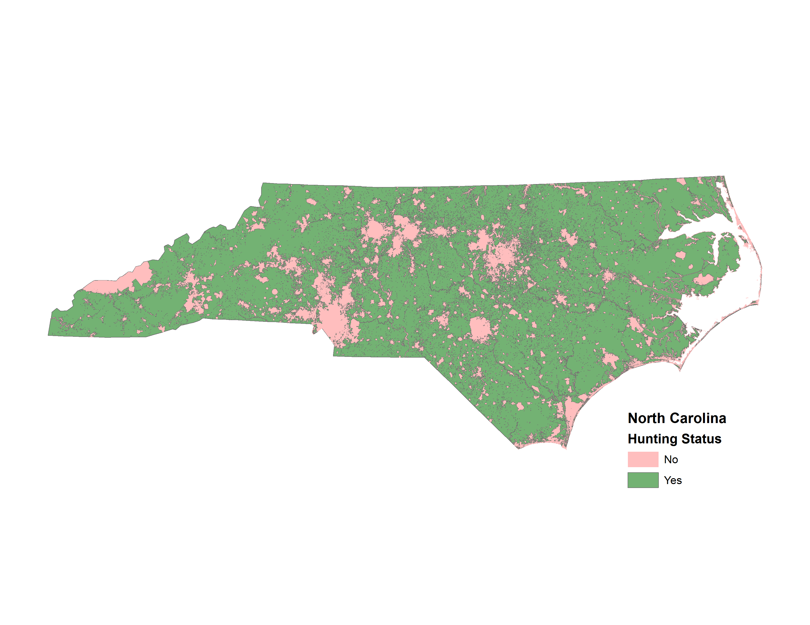

# Huntable lands in North Carolina
This repository contains a shapefile of the huntable lands in North Carolina. The layer follows North Carolina Wildlife Resource Commission's definition of an unhuntable land: "Where conventional hunting may be limited or prohibited", and is based on the following features: Federal and State parks; Municipal boundaries; Water bodies; Human density greeater than 1 person per 2 acres. See page 14 of this repository's PDF, 'Evaluation of Deer Hunting Seasons and Management Units' published by the North Carolina Wildlife Resource Commission. 

